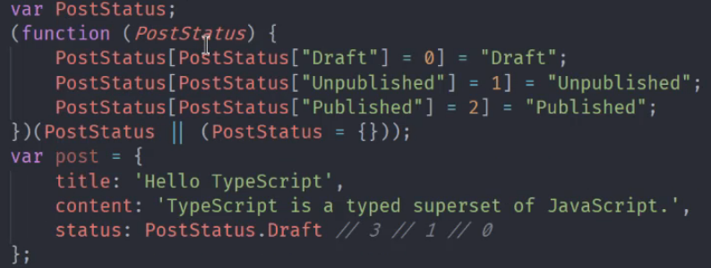

# TS
#### object 类型不光指object，还包括 function，[]，即所有非简单值

#### 枚举类
```typescript
enum PostStatus {
    create, // create = 0
    publish,
    delete
}
/*  枚举类型中，如果未赋值，则从0开始依次累加，若create为6，则从6开始累加
    若第一个字段为字符串，则后续字段无法使用累加的功能，
*/

const a = PostStatus.create // 0
```

##### 枚举类型，在ts编译成js时，会侵入js，生成一个双向的键值对对象其他则会在编译之后移除TS代码


##### 若不希望这样，可以在`enum xxx {}`前，添加`const`

#### 访问修饰符
##### `private`，`public`，`protected` 控制成员的可访问级别，默认是`public`
* public：所有定义成public的属性和方法都可以在任何地方进行访问。
* private：所有定义成private的属性和方法都只能在类定义内部进行访问。
* protected：多有定义成protected的属性和方法可以从类定义内部访问，也可以从`子类中访问`<b>（可继承）</b>。

注：构造函数的访问修饰符`constructor`也是`public`，如果在`constructor`前面添加`private`
那么该构造函数就无法在外部 `new`，此时可以在`类`的内部添加一个静态方法，通过此方法实例

#### 类使用接口（implements）
```typescript
interface EatAndRun {
  eat(food: string): void
  run(distance: string): void
}

// C# 和java，推荐用于类的接口尽量简单
interface Eat {
  eat(food: string): void
}
interface Run {
  run(distance: string): void
}

class Animal implements EatAndRun {
    eat(food) {
        console.log('吃吃吃', food)
    }

    run(food) {
        console.log('跑跑跑', food)
    }
}

class Person implements Eat, Run {
    eat(food) {
        console.log('吃吃吃', food)
    }

    run(food) {
        console.log('跑跑跑', food)
    }
}
```

#### 抽象类 (abstract)
```typescript
// 抽象类只能继承，不能new
abstract class Animal {
    eat(food: string): void {
        console.log('吃吃吃', food)
    }

    abstract run(distance: string): void
}

const a = new Animal() // Abstract class cannot be instantiated 

class Dog extends Animal {
    run(distance:string):void{
        console.log('跑跑跑', distance)
    }
}
```

#### 泛型
##### 对于一些定义时不能够明确的类型，可以在定义的时候使用一个参数`<T>`，到使用的时候再定义该参数


